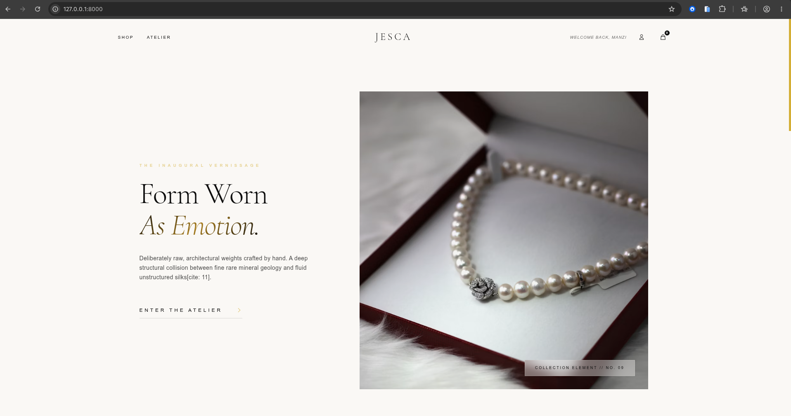
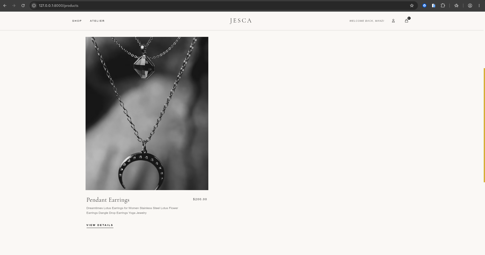
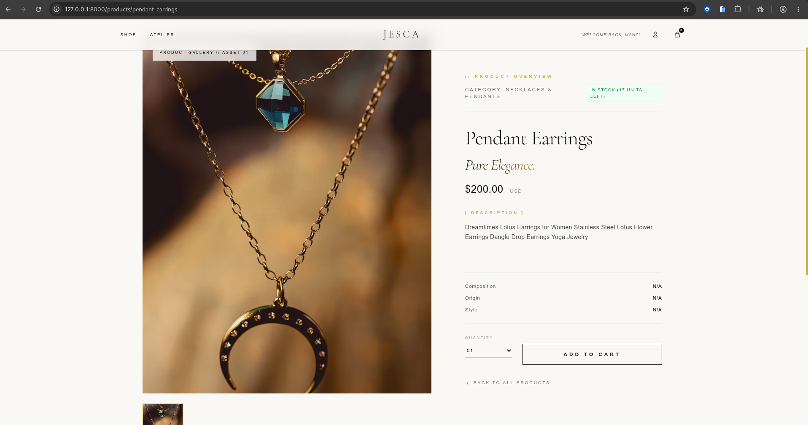
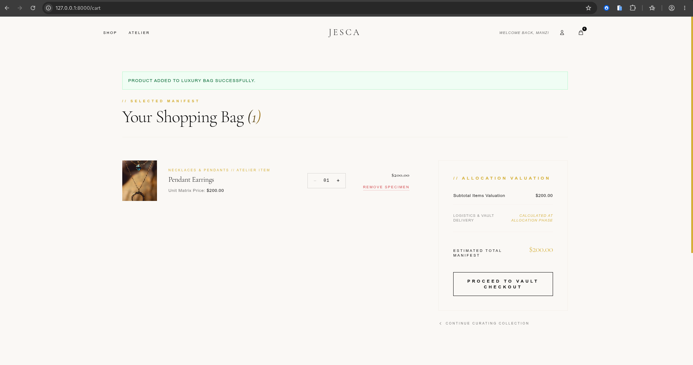
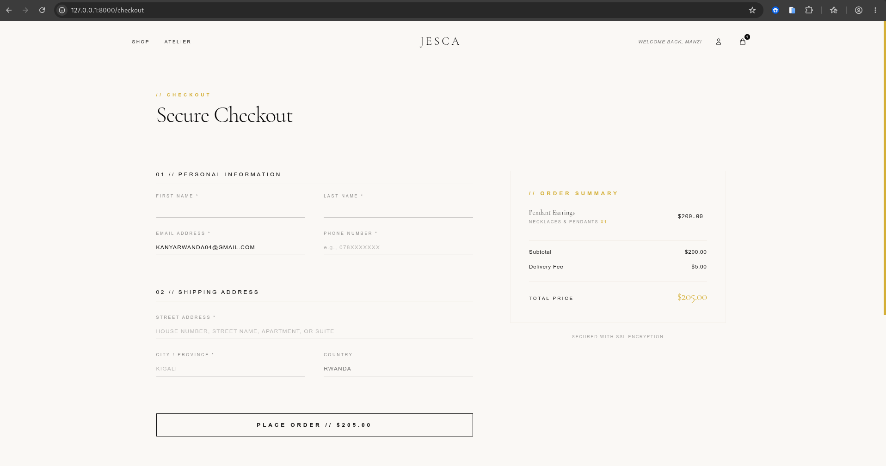
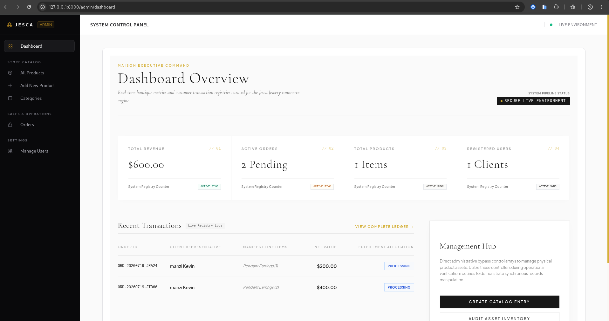
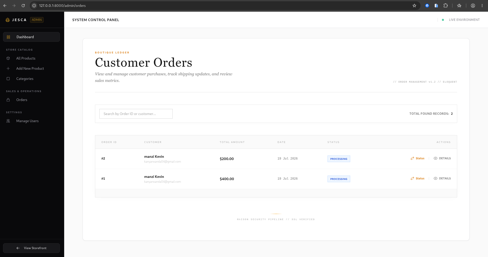
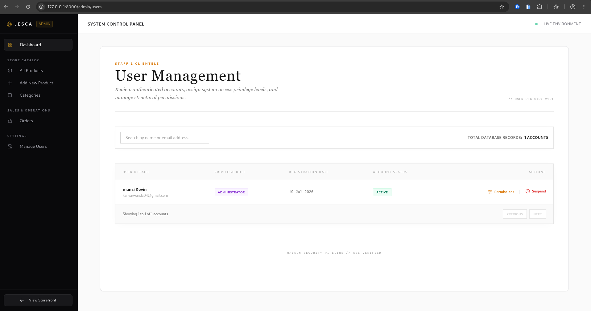
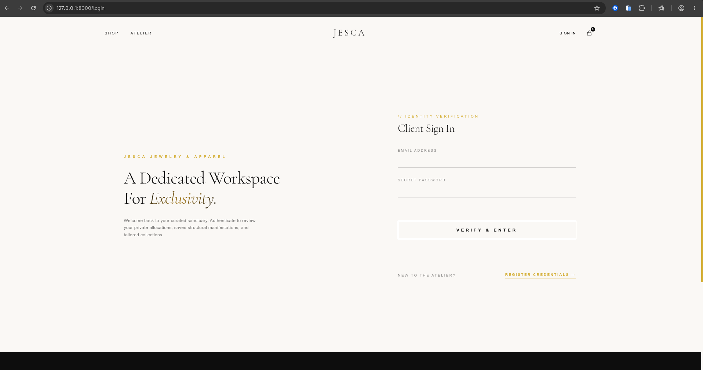

# JescaJewery Shop

[](https://laravel.com)
[](https://www.php.net)
[](https://livewire.laravel.com)
[](https://alpinejs.dev)
[](https://tailwindcss.com)
[](https://www.mysql.com)
[](https://vitejs.dev)
[](https://www.docker.com)
[](https://railway.app)
[](https://git-scm.com)
[](#license)

An elegant e-commerce marketplace for jewelry and modern clothing, built with Laravel, Livewire, Alpine.js, and Tailwind CSS v4.

**Author:** BYIRINGIRO Jesca — Information System Management Student
**Reg NO:** : **24708/2024**

---

## Table of Contents

1. [Introduction](#1-introduction)
2. [Problem Statement](#2-problem-statement)
3. [Project Objectives](#3-project-objectives)
4. [System Features](#4-system-features)
5. [Technologies Used](#5-technologies-used)
6. [System Architecture](#6-system-architecture)
7. [Database Design](#7-database-design)
8. [Screenshots of the Application](#8-screenshots-of-the-application)
9. [GitHub Repository Link](#9-github-repository-link)
10. [Deployment Link](#10-deployment-link)
11. [CI/CD Implementation](#11-cicd-implementation)
12. [Docker Implementation](#12-docker-implementation)
13. [Challenges Encountered](#13-challenges-encountered)
14. [Future Enhancements](#14-future-enhancements)
15. [Conclusion](#15-conclusion)

---

## 1. Introduction

JescaJewery Shop is a full-stack e-commerce web application developed following Laravel's Model–View–Controller (MVC) architecture. The system enables customers to browse, search, and purchase elegant jewelry and modern clothing online, while giving administrators a secure panel to manage inventory, orders, and users.

The application supports both jewelry and clothing product catalogs, with a responsive interface optimized for desktop, tablet, and mobile devices. It was built using Laravel 12, Livewire 3, Alpine.js 3, and Tailwind CSS v4, combining server-side rendering with lightweight, reactive front-end interactivity to deliver a fast and modern shopping experience without the overhead of a separate JavaScript framework.

Beyond the application itself, the project includes a full delivery pipeline: automated testing and code-style enforcement via GitHub Actions, and a containerized production build deployed to Railway using Docker.

This report documents the design, development, implementation, and deployment of the JescaJewery Shop system as part of an academic software engineering project.

---

## 2. Problem Statement

In many local markets, jewelry and clothing sellers still rely on manual, in-person, or fragmented processes (physical boutiques, unstructured social media listings, word-of-mouth) to showcase their pieces and manage sales. This approach creates several recurring problems:

- **Limited visibility:** Customers cannot browse the full collection remotely, compare pieces, or view detailed images before visiting in person.
- **No centralized inventory system:** Sellers manage stock, pricing, and availability manually, making it difficult to keep listings accurate and up to date.
- **Unstructured ordering process:** There is no reliable way to place an order, track its status, or maintain a history of customer purchases.
- **Poor scalability:** Manual processes do not scale well as inventory or customer volume grows, and they are prone to human error (overselling, lost records, miscommunication).
- **Lack of administrative oversight:** Without a dashboard, staff cannot easily monitor sales performance, manage users, or feature specific pieces for promotion.

JescaJewery Shop addresses these problems by providing a digital marketplace where customers can browse a categorized product catalog of jewelry and modern clothing, filter and search by criteria, add items to a cart, and complete orders online — while administrators manage the entire inventory, order, and sales pipeline through a dedicated, secure dashboard.

---

## 3. Project Objectives

The project aims to:

- Design and implement a full-stack e-commerce marketplace using the Laravel ecosystem (Laravel, Livewire, Alpine.js, Tailwind CSS v4).
- Provide customers with an intuitive interface to browse, search, and filter jewelry and clothing by category, price, and other attributes.
- Implement a shopping cart and wishlist system for saving and purchasing favorite pieces.
- Build a secure checkout and order processing workflow, from cart to confirmed order.
- Develop a comprehensive admin dashboard for managing categories, products, orders, and users.
- Apply MVC architecture, Eloquent ORM, and relational database design best practices.
- Demonstrate responsive, component-based UI development suitable for desktop, tablet, and mobile use.
- Reinforce secure authentication and role-based access control between customers and administrators.
- Establish an automated CI pipeline to enforce code quality and prevent regressions.
- Containerize the application with Docker for consistent, reproducible deployment.

---

## 4. System Features

### Customer Features

- Product catalog with categorized browsing (jewelry and modern clothing)
- Advanced search
- Product filtering (by category, price, material, size, etc.)
- Product details page with full descriptions and specifications
- Image gallery for each product
- Shopping cart
- Wishlist for saving favorite pieces
- Checkout process
- User authentication (registration, login, password management)
- Order history
- Fully responsive design across desktop, tablet, and mobile

### Administration Features

- Admin Dashboard with key metrics overview
- Category Management (create, update, delete categories)
- Product Management (create, update, delete listings)
- Multi-image Uploads per product
- Order Management (track and update order status)
- User Management (view and manage registered users)
- Featured Product Management (highlight selected pieces on the homepage)

---

## 5. Technologies Used

| Category             | Technology                 |
| --------------------- | --------------------------- |
| Backend              | Laravel 12                 |
| Frontend             | Blade                      |
| Components           | Livewire                   |
| JavaScript           | Alpine.js                  |
| Styling              | Tailwind CSS v4            |
| Database             | MySQL                      |
| ORM                   | Eloquent ORM               |
| Authentication        | Laravel Authentication     |
| Build Tool             | Vite                       |
| Runtime (Production)  | PHP 8.4 (Alpine)           |
| Containerization      | Docker (multi-stage build) |
| Hosting               | Railway                    |
| CI/CD                  | GitHub Actions             |
| Code Style             | Laravel Pint               |
| Version Control       | Git                        |

---

## 6. System Architecture

The application follows the Model–View–Controller (MVC) architecture, with Livewire components layered in to handle reactive, stateful UI without full page reloads.

```text
                   Client Browser
                         │
                         ▼
                     Laravel Routes
                         │
                         ▼
                    HTTP Controllers
                         │
          ┌──────────────┴──────────────┐
          ▼                             ▼
      Livewire Components          Blade Views
          │                             │
          └──────────────┬──────────────┘
                         ▼
                  Eloquent Models
                         │
                         ▼
                    MySQL Database
```

Requests enter through Laravel's routing layer and are dispatched to HTTP controllers. Interactive, data-driven sections of the UI (such as filtering, cart updates, and wishlist toggles) are handled by Livewire components, which communicate directly with Eloquent models, while largely static or presentational sections are rendered through Blade views. Alpine.js is layered on top for lightweight, client-side interactivity (dropdowns, modals, image galleries) that doesn't require a full server round-trip. All persistent data flows through Eloquent ORM into the MySQL database.

In production, this same application is compiled into a Docker image and served behind Railway's routing layer (see [Section 12](#12-docker-implementation)).

### Core Modules

- Authentication
- User Management
- Product Management
- Category Management
- Product Gallery
- Shopping Cart
- Wishlist
- Checkout
- Order Processing
- Admin Dashboard

### Project Structure

```text
app/
├── Http/
├── Livewire/
├── Models/
├── Providers/

bootstrap/

config/

database/
├── factories/
├── migrations/
├── seeders/

public/

resources/
├── css/
├── js/
├── views/

routes/

storage/

tests/

.github/
└── workflows/
    └── ci.yml

Dockerfile
.dockerignore
railway.json
```

---

## 7. Database Design

The application consists of the following core entities, connected through foreign key relationships managed by Laravel's Eloquent ORM:

| Entity              | Description                                                                                                      |
| -------------------- | ------------------------------------------------------------------------------------------------------------------ |
| **Users**           | Stores customer and admin accounts, including authentication credentials and role.                               |
| **Categories**      | Product categories/collections (e.g., Rings, Necklaces, Dresses, Outerwear), each with many products.            |
| **Products**        | Core inventory entity — name, price, description, type (jewelry/clothing), and status. Belongs to a Category.    |
| **Product Images**  | Multiple images per product for the gallery. Belongs to a Product (one-to-many).                                  |
| **Wishlist Items**  | Products a user has saved for later. Belongs to a User and a Product.                                            |
| **Cart Items**      | Items a user has added to their cart before checkout. Belongs to a User and a Product.                            |
| **Orders**          | A confirmed purchase, generated from checkout. Belongs to a User.                                                  |
| **Order Items**     | Line items within an order, linking Orders to specific Products. Belongs to an Order.                             |

**Key relationships:**

- A **Category** has many **Products**; a **Product** belongs to a **Category**.
- A **Product** has many **Product Images**.
- A **User** has many **Wishlist Items**, **Cart Items**, and **Orders**.
- An **Order** has many **Order Items**, and each **Order Item** references a **Product**.
- A **Wishlist Item** links a **User** to a specific **Product** they wish to purchase later.

This relational structure keeps product, cart, and order data normalized, avoids duplication, and allows efficient querying (e.g., fetching a user's full order history with related product and category data in a single Eloquent query using eager loading).

---

## 8. Screenshots of the Application

Create a folder named:

```text
screenshots/
```

Recommended images:

```text
screenshots/
│
├── homepage.png
├── products.png
├── product-details.png
├── cart.png
├── checkout.png
├── dashboard.png
├── orders.png
└── users.png
```

### Homepage



### Product Listing



### Product Details



### Shopping Cart




### Checkout



### Admin Dashboard



### Order Management



### User Management



### Login Page



---

## 9. GitHub Repository Link

```text
https://github.com/byiringiroJesca/Jesca-jewery-ecommerce
```

---

## 10. Deployment Link

The application is packaged as a Docker image (see [Section 12](#12-docker-implementation)) and deployed to **Railway**, configured to build from the project's `Dockerfile` via `railway.json`.

```text
Live URL: [https://jesca-jewery-ecommerce-production.up.railway.app]
```


---

## 11. CI/CD Implementation

Continuous integration is implemented using **GitHub Actions**, defined in `.github/workflows/ci.yml`. The pipeline runs automatically on every push and pull request to the `main` branch and performs the following steps:

1. **Checkout code** — `actions/checkout@v4`
2. **Set up PHP 8.4** — via `shivammathur/setup-php@v2`, with required extensions (`dom`, `curl`, `libxml`, `mbstring`, `zip`, `pcntl`, `pdo`, `sqlite`, `pdo_sqlite`, `bcmath`, `soap`, `intl`, `gd`)
3. **Install Composer dependencies** — `composer install --no-interaction --prefer-dist`
4. **Copy environment file** — `cp .env.example .env`, so the runner has a `.env` to write into
5. **Generate application key** — `php artisan key:generate`
6. **Install Node dependencies** — `npm install`
7. **Run automated tests** — `php artisan test`
8. **Enforce code style** — `./vendor/bin/pint --test`, using Laravel Pint to catch formatting violations (import ordering, spacing, trailing commas/whitespace, etc.) before merge
9. **Build frontend assets** — `npm run build`, verifying the production Vite build succeeds

```yaml
name: Laravel CI Pipeline

on:
    push:
        branches: [main]
    pull_request:
        branches: [main]

jobs:
    test-and-build:
        runs-on: ubuntu-latest
        steps:
            - uses: actions/checkout@v4

            - name: Setup PHP
              uses: shivammathur/setup-php@v2
              with:
                  php-version: "8.4"
                  extensions: dom, curl, libxml, mbstring, zip, pcntl, pdo, sqlite, pdo_sqlite, bcmath, soap, intl, gd

            - name: Install Composer dependencies
              run: composer install --no-interaction --prefer-dist

            - name: Copy .env
              run: cp .env.example .env

            - name: Generate App Key
              run: php artisan key:generate

            - name: Install Node dependencies
              run: npm install

            - name: Run Tests
              run: php artisan test

            - name: Run Pint (Code Styling)
              run: ./vendor/bin/pint --test

            - name: Build Frontend
              run: npm run build
```

This ensures every change is validated — tests pass, code style is consistent, and the frontend build succeeds — before it reaches `main`.

---

## 12. Docker Implementation

The application is containerized using a **multi-stage Docker build**, separating the frontend build stage from the production PHP runtime to keep the final image lean.

**Stage 1 — Frontend build (`node:20-alpine`):** installs npm dependencies and compiles frontend assets with Vite (`npm run build`), producing the `public/build` directory.

**Stage 2 — Production runtime (`php:8.4-cli-alpine`):**

- Installs required system packages (`bash`, `curl`, `zip`, `unzip`, `libzip-dev`, `oniguruma-dev`, `libpng-dev`, `libjpeg-turbo-dev`, `freetype-dev`)
- Installs PHP extensions: `pdo`, `pdo_mysql`, `mbstring`, `zip`, `exif`, `pcntl`, `bcmath`, `gd`
- Copies Composer from the official `composer:2` image
- Copies the application source and the compiled frontend assets from Stage 1
- Runs `composer install --no-dev --optimize-autoloader` for a production-optimized dependency set
- Ensures the `storage/` and `bootstrap/cache` directory structure exists and is writable
- Caches Laravel config, routes, and views at container start, then serves the app via PHP's built-in server bound to Railway's `$PORT`

```dockerfile
CMD sh -c "\
    php artisan config:cache && \
    php artisan route:cache && \
    php artisan view:cache && \
    php -S 0.0.0.0:${PORT:-8080} -t public \
"
```

**Deployment configuration:** a `railway.json` file explicitly sets Railway's builder to `DOCKERFILE` (rather than its default Nixpacks auto-detection), so the platform builds and runs the project's actual `Dockerfile`.

**Required environment variables** (set in Railway's dashboard, not baked into the image): `APP_KEY` (generated once locally via `php artisan key:generate --show` and stored as a static variable — never regenerated inside the ephemeral container), `APP_ENV`, `APP_DEBUG`, and the `DB_*` database credentials.

**Migrations** are run as a one-off Railway deploy/release command (`php artisan migrate --force`) rather than inside the container's `CMD`, keeping schema changes intentional and separate from the app's start command.

A `.dockerignore` file excludes `.git`, `.env`, `node_modules`, `vendor`, `tests`, and other non-runtime files from the build context, keeping the image small and preventing local secrets from leaking into the build.

---

## 13. Challenges Encountered

During development and deployment, several real challenges were encountered and resolved:

- **Coordinating Livewire and Alpine.js state:** Since Livewire handles server-driven reactivity while Alpine.js handles purely client-side interactivity, care was needed to avoid conflicts between the two — for example, ensuring cart quantity updates and wishlist toggles triggered by Alpine.js UI events correctly synced back to Livewire-managed server state without causing duplicate re-renders.
- **Modeling relational data correctly:** Designing the relationships between Products, Categories, Wishlist Items, Cart Items, Orders, and Order Items required careful planning to avoid data duplication while still supporting efficient queries (e.g., using Eloquent eager loading to prevent N+1 query problems on the product listing and order history pages).
- **Multi-image upload handling:** Implementing multi-image uploads per product required configuring Laravel's file storage system correctly, including running `php artisan storage:link` so uploaded images were publicly accessible, and validating file types/sizes on both the client and server side.
- **CI failing on a missing `.env`:** The GitHub Actions pipeline initially failed at `php artisan key:generate` because the runner had no `.env` file (it's git-ignored). Fixed by adding a `cp .env.example .env` step before key generation.
- **PHP version mismatch during Railway deployment:** `composer.lock` had resolved dependencies (Symfony 8.x, Laravel Framework v13) requiring PHP ≥8.4.1, but Railway's default Nixpacks builder provisioned PHP 8.3, causing `composer install` to fail. Resolved by writing a custom multi-stage `Dockerfile` pinned to `php:8.4-cli-alpine`, and forcing Railway to actually use it via `railway.json` (the platform defaults to Nixpacks auto-detection otherwise).
- **Code style violations surfaced by Pint in CI:** Once `./vendor/bin/pint --test` was added to the pipeline, it caught formatting issues across dozens of files (unused imports, import ordering, spacing, trailing commas/whitespace). Fixed by running `./vendor/bin/pint` locally (without `--test`) to auto-format the codebase and committing the result.
- **Cart and stock concurrency:** Preventing overselling of low-stock or one-of-a-kind jewelry pieces required additional validation logic at checkout, since multiple users could attempt to purchase the same limited-stock item at the same time.
- **Responsive design across breakpoints:** Ensuring a consistent, elegant experience across desktop, tablet, and mobile — particularly for product image galleries, filter panels, and the admin dashboard tables — required iterative refinement of the Tailwind CSS v4 utility classes and layout structure.

---

## 14. Future Enhancements

- Online Payment Gateway
- Mobile Money Integration
- Product Reviews & Ratings
- Size and Fit Guide for Clothing
- Jewelry Customization Options (engraving, gemstone selection)
- Notifications
- REST API
- Mobile Application
- Reporting Dashboard
- Analytics
- Add a `services: mysql` block to CI so `php artisan test` runs against MySQL rather than relying solely on SQLite, closer to the production database engine

---

## 15. Conclusion

JescaJewery Shop successfully demonstrates a full-stack solution to the problem of fragmented, manual jewelry and clothing sales processes by providing a centralized, digital marketplace for browsing and purchasing elegant pieces. The system delivers a complete customer journey — from catalog browsing and filtering through to cart management, wishlist, checkout, and order history — alongside a comprehensive administrative dashboard for managing inventory, orders, and users.

Technically, the project demonstrates practical, hands-on application of MVC architecture, Eloquent ORM and relational database design, secure authentication and role-based access, CRUD operations, file/image upload management, and responsive, component-based front-end development using Livewire, Alpine.js, and Tailwind CSS v4. Beyond the application layer, the project also demonstrates production engineering practices: an automated GitHub Actions CI pipeline enforcing tests and code style, and a containerized Docker deployment to Railway — reflecting a complete, modern software delivery workflow rather than just a working local build.

Beyond its academic objectives, the architecture, CI/CD pipeline, and containerized deployment of JescaJewery Shop provide a solid foundation for real-world extension — including payment integration, a public REST API, and analytics — making it a practical demonstration of both software engineering fundamentals and production-oriented system design.

---

## Academic Objectives

This project demonstrates practical implementation of:

- MVC Architecture
- Laravel Framework
- Authentication & Authorization
- CRUD Operations
- Eloquent ORM
- Database Relationships
- File Upload Management
- Shopping Cart Logic
- Order Management
- Responsive Web Design
- Component-based Development
- Modern UI Development
- CI/CD Pipelines
- Containerization with Docker

---

## Installation

### Clone Repository

```bash
git clone https://github.com/byiringirojesca/Jesca-jewery-ecommerce

cd jescajewery-shop
```

### Install Dependencies

```bash
composer install

npm install
```

### Environment Configuration

```bash
cp .env.example .env
```

Generate the application key.

```bash
php artisan key:generate
```

Update your database credentials inside the `.env` file.

```env
DB_CONNECTION=mysql
DB_HOST=127.0.0.1
DB_PORT=3306
DB_DATABASE=jescajewery_shop
DB_USERNAME=root
DB_PASSWORD=
```

### Database Migration

```bash
php artisan migrate
```

(Optional)

```bash
php artisan db:seed
```

### Storage Link

```bash
php artisan storage:link
```

### Build Frontend Assets

Development

```bash
npm run dev
```

Production

```bash
npm run build
```

### Run Development Server

```bash
php artisan serve
```

Visit

```
http://127.0.0.1:8000
```

### Run with Docker (Production-style)

```bash
docker build -t jescajewery-shop .
docker run -p 8080:8080 --env-file .env jescajewery-shop
```

Visit

```
http://127.0.0.1:8080
```

---

## Performance Features

- Server-side rendering with Blade
- Livewire reactive components
- Alpine.js lightweight interactivity
- Tailwind CSS utility-first styling
- Optimized Eloquent relationships
- Database indexing
- Responsive layouts
- Optimized image handling
- Production-optimized Composer autoloader (`--optimize-autoloader --no-dev`)
- Cached config, routes, and views in the Docker production image

---

## Repository Topics

```text
laravel
php
livewire
alpinejs
tailwindcss
tailwindcss-v4
blade
mysql
mvc
ecommerce
jewelry-store
clothing-store
fashion
responsive-design
crud
shopping-cart
wishlist
authentication
web-application
academic-project
docker
cicd
github-actions
railway
```

---

## License

This project was developed for educational and academic purposes.

---

## Author

**BYIRINGIRO Jesca**

Software Engineering Student 

**Reg NO:** : **24708/2024**

---

## Acknowledgements

This project was developed as part of an academic software engineering project to demonstrate modern full-stack web development using Laravel, Livewire, Alpine.js, and Tailwind CSS v4, along with production-oriented practices including automated CI/CD and Docker-based deployment, while following best practices in software architecture, responsive design, and database management.